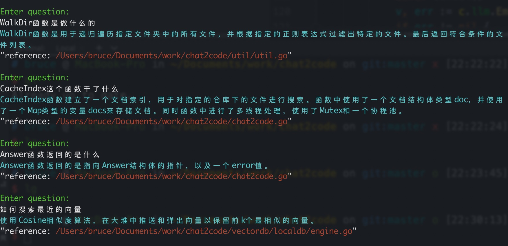

# Chat 2 Code

```shell
 ██████╗██╗  ██╗ █████╗ ████████╗    ██████╗      ██████╗ ██████╗ ██████╗ ███████╗
██╔════╝██║  ██║██╔══██╗╚══██╔══╝    ╚════██╗    ██╔════╝██╔═══██╗██╔══██╗██╔════╝
██║     ███████║███████║   ██║        █████╔╝    ██║     ██║   ██║██║  ██║█████╗  
██║     ██╔══██║██╔══██║   ██║       ██╔═══╝     ██║     ██║   ██║██║  ██║██╔══╝  
╚██████╗██║  ██║██║  ██║   ██║       ███████╗    ╚██████╗╚██████╔╝██████╔╝███████╗
 ╚═════╝╚═╝  ╚═╝╚═╝  ╚═╝   ╚═╝       ╚══════╝     ╚═════╝ ╚═════╝ ╚═════╝ ╚══════╝
```
中文 | [English](./README_en.md)

## What
Chat2Code是一个可以让程序员用自然语言和代码对话的工具


## Why
程序员经常会发出灵魂拷问：
* 🤔"xxx这个函数是干嘛的？"
* 🤔"xxx这个函数的实现原理是什么？"  
* 🤔"怎么样才能实现xxx功能？"
* 🤔"有实现了xxx功能的函数吗？"  
通常情况你身边没有一个能随时随地给你答案的人  
**Chat2Code:"来问我💻"**

## How
1. 预分析代码
   1. 先通过过滤规则遍历出目录需要分析的文件
   2. 对其切分合适大小的chunk  
   3. 对chunk进行文本嵌入向量化(Embedding)
   4. 对chunk建立索引和向量一并存储本地缓存
2. 问答
   1. 将自然语言问题文本向量化
   2. 在本地缓存中查找最近向量，得到对应的chunk
   3. 将chunk文本作为回话本问题的context，和问题一并喂给大语言模型，大语言模型总结回答问题

   

## Feature
* 自然语言描述代码相关问题更精准，更符合直觉，大语言模型结合关键代码来回答
* 索引缓存能避免每次分析消耗大量api token
* 使用openai的Embedding对代码分析更精准
* 本地向量查询不依赖外部接口，更快更安全

## CLI(Command Line Interface) Usage
1. 安装
```shell
go install github.com/byebyebruce/chat2code/cmd/chat2code@latest
```
2. 设置OPENAI_API_KEY环境变量`export OPENAI_API_KEY=xxxx`
3. load一个代码目录 `chat2code load {code_path}`
4. 开始和代码对话吧 `chat2code`

## Reference
* [LLM](https://platform.openai.com/docs/guides/chat)
* [Embedding](https://platform.openai.com/docs/guides/embeddings)
* [Vector Search](./vector_store/math.go)
* [Storage](https://github.com/boltdb/bolt)