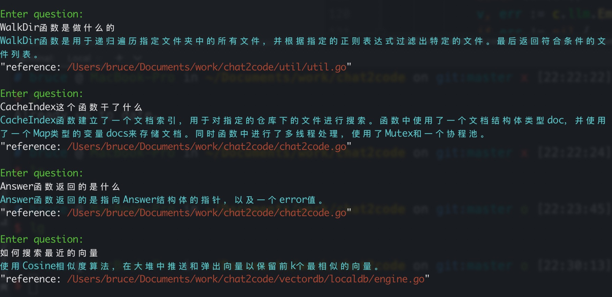
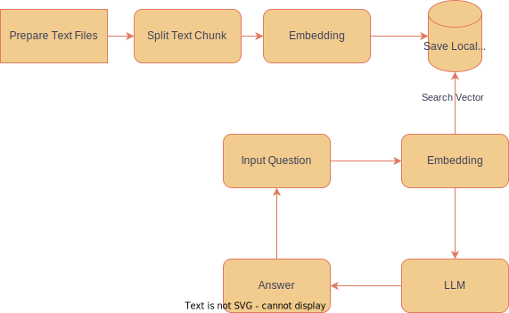

# Chat 2 Code

```shell
 ██████╗██╗  ██╗ █████╗ ████████╗    ██████╗      ██████╗ ██████╗ ██████╗ ███████╗
██╔════╝██║  ██║██╔══██╗╚══██╔══╝    ╚════██╗    ██╔════╝██╔═══██╗██╔══██╗██╔════╝
██║     ███████║███████║   ██║        █████╔╝    ██║     ██║   ██║██║  ██║█████╗  
██║     ██╔══██║██╔══██║   ██║       ██╔═══╝     ██║     ██║   ██║██║  ██║██╔══╝  
╚██████╗██║  ██║██║  ██║   ██║       ███████╗    ╚██████╗╚██████╔╝██████╔╝███████╗
 ╚═════╝╚═╝  ╚═╝╚═╝  ╚═╝   ╚═╝       ╚══════╝     ╚═════╝ ╚═════╝ ╚═════╝ ╚══════╝
```
[中文](./README.md) | English

## What
Chat2Code is a tool that allows programmers to have a conversation with code using natural language.


## Why
Programmers often have soul-searching questions like:

🤔"What does this function do?"  
🤔"What is the implementation principle of this function?"  
🤔"How can I implement this function?"  
🤔"Are there any functions that implement this feature?"  
Usually, there is no one around you who can give you the answer anytime, anywhere.  
Chat2Code: "I'm here to help you💻"


## How
1. Pre-analyze the code
   1. Traverse the files in the directory that need to be analyzed through filtering rules
   2. Cut the chunk into an appropriate size
   3. Embedding the text of the chunk
   4. Store the index and vector of the chunk in the local cache.
   
2. Q&A
   1. Vectorize the natural language question text
   2. Look up the nearest vector in the local cache to get the corresponding chunk.
   3. Use the chunk text as the context of the conversation and feed it to the large language model to summarize and answer the question.

      

## Feature
* Natural language description of code-related issues is more accurate and intuitive, and the large language model combines key code to answer questions.
* Index cache can avoid consuming a large number of API tokens for analysis every time.
* Using openai's Embedding for code analysis is more accurate.
* Local vector query does not rely on external interfaces, making it faster and safer.


## CLI(Command LineV Interface) Usage
1. Install
```shell
go install github.com/byebyebruce/chat2code/cmd/chat2code@latest
```
2. Set the OPENAI_API_KEY environment variable`export OPENAI_API_KEY=xxxx`. If you want to set OpenAI base url `export OPENAI_API_BASE=https://xxx`
3. Run and pass in a code directory chat2code `chat2code load {code_dir}`
4. Ok, chat with your code `chat2code`

## Reference
* [LLM](https://platform.openai.com/docs/guides/chat)
* [Embedding](https://platform.openai.com/docs/guides/embeddings)
* [Vector Search](./vector_store/math.go)
* [Storage](https://github.com/boltdb/bolt)


